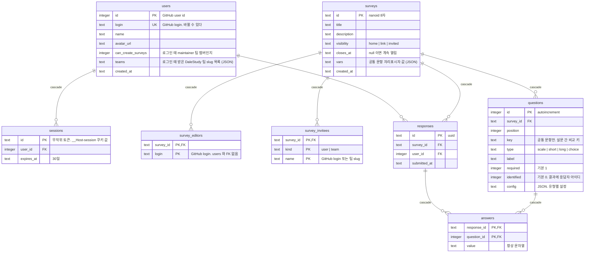

# 데이터베이스

`src/db/schema.ts` 가 원본이다. 이 문서는 관계, 컬럼의 뜻, 설계 이유를 설명한다. 스키마를 바꾸면 이 문서도 같이 고친다. 문항 유형과 `config` 는 [questions.md](questions.md).



## 세 덩어리

**설문** — `surveys → questions`
설문은 홀로 선다. 기수나 프로그램에 매이지 않고, 제목이 "블로그 스터디 1기 참여 회고" 같은 맥락을 담는다. 문항은 설문마다 행으로 복사되고, 공통 문항은 `key` 로만 묶인다 — 설문끼리 비교할 때 쓰는 유일한 연결이다.

**응답** — `responses → answers`
응답 하나가 한 사람이 설문 하나에 낸 것이고, 답은 문항당 한 행이다 (long format). 설문마다 넓은 테이블을 만들지 않아 설문을 추가해도 마이그레이션이 없고, `questions.key` 로 설문을 가로질러 집계할 수 있다.

**사람** — `users`, `sessions`, `survey_editors`
`users` 는 GitHub 로그인 때 upsert 되고 `sessions` 가 그것을 가리킨다. 로그인할 때 DaleStudy 조직의 `maintainer` 팀 멤버인지 확인해 `can_create_surveys` 에 적는다 — 새 설문은 이 사람만 만든다. 설문을 고치고 결과를 보는 사람은 `survey_editors` 가 정한다. 만든 사람이 처음 들어가고, 편집자가 다른 GitHub 계정을 더한다.

## 테이블

### surveys

| 컬럼 | 설명 |
|---|---|
| `id` | nanoid 8자. URL 에 그대로 나온다 (`/V1StGXR8`) |
| `title` | |
| `description` | 응답 시작 화면의 안내문. null 가능. 예상 시간·익명 여부처럼 화면이 계산해 보여 주는 것은 적지 않는다 |
| `visibility` | `home`: 로그인한 누구나 홈에서 보고 답한다. `link`: 홈에 안 보이고 링크를 받은 사람만. `invited`: `survey_invitees` 의 사람·팀(과 편집자)만 홈에서 보고 답한다 |
| `closes_at` | ISO 8601 UTC. null 이면 계속 열림. 편집 화면은 날짜만 받아 그날 23:59:59 KST 로 저장한다. "지금 마감"은 지금 시각을, "다시 열기"는 null 을 넣는다 |
| `vars` | 공통 문항 자리표시자 값 (`program`, `period`, `activity`, `artifact`, `redo`, `next`). 공통 문항을 넣을 때 문구를 채운다. null 가능 |
| `created_at` | ISO 8601 UTC |

### survey_editors

설문을 고치고 결과를 보는 사람. GitHub login 으로 적으므로 아직 로그인한 적 없는 사람도 넣을 수 있다. 마지막 한 명은 뺄 수 없다.

| 컬럼 | 설명 |
|---|---|
| `survey_id` | PK, FK → surveys. 설문 삭제 시 cascade |
| `login` | PK. GitHub login. `users` 와 FK 없음 |

### survey_invitees

`visibility` 가 `invited` 인 설문의 대상. 편집자처럼 GitHub 이름으로 적어 아직 로그인한 적 없는 사람도 넣을 수 있다.

| 컬럼 | 설명 |
|---|---|
| `survey_id` | PK, FK → surveys. cascade |
| `kind` | PK. `user`(GitHub login) 또는 `team`(DaleStudy 팀 slug) |
| `name` | PK. login 은 대소문자를 가리지 않고 비교한다. 팀은 `users.teams` 와 맞춰 본다 |

### questions

| 컬럼 | 설명 |
|---|---|
| `id` | autoincrement. `answers` 가 이걸 가리킨다 |
| `survey_id` | FK → surveys. cascade |
| `position` | 표시 순서 (1부터) |
| `key` | 공통 문항의 안정 키. 이 설문만의 문항은 null |
| `type` | `scale` / `short` / `long` / `choice` |
| `label` | 응답자에게 보이는 문구. 자리표시자는 저장할 때 이미 치환됨 |
| `required` | 0/1 |
| `identified` | 1 이면 결과 화면에서 이 문항의 답에만 응답자 GitHub 아이디를 붙인다. 공통 문항 정의가 정한다 (`join_organizers`) |
| `config` | 유형별 설정 JSON. null 이면 유형 기본값 |

### responses

| 컬럼 | 설명 |
|---|---|
| `id` | UUID |
| `survey_id` | FK → surveys. cascade |
| `user_id` | FK → users. 답한 사람. 결과 화면에는 보여 주지 않는다 (`identified` 문항만 예외) |
| `submitted_at` | ISO 8601 UTC |

### answers

응답 한 건의 문항별 값. 비필수 문항의 빈 답은 행이 없다.

| 컬럼 | 설명 |
|---|---|
| `response_id` | PK, FK → responses. cascade |
| `question_id` | PK, FK → questions. cascade |
| `value` | 항상 문자열. `scale` 은 `"4"`, `choice` 는 보기 문구 그대로 |

### users

GitHub 로그인 때 upsert 되는 신원 캐시.

| 컬럼 | 설명 |
|---|---|
| `id` | GitHub user id. login 이 바뀌어도 불변이라 응답자 키로 쓴다 |
| `login` | UNIQUE. 바뀔 수 있다. 옛 login 을 다른 사람이 가져오면 옛 행은 `login#id` 로 비켜 준다 (`auth.callback.tsx`) |
| `name` | GitHub 표시 이름. null 가능 |
| `avatar_url` | |
| `can_create_surveys` | 로그인할 때 DaleStudy `maintainer` 팀 멤버인지 확인해 적는다. 팀이 바뀌면 다음 로그인 때 반영 |
| `teams` | 로그인할 때 받아 두는 DaleStudy 팀 slug 목록(JSON). 팀으로 대상을 정한 설문이 본다. 토큰을 저장하지 않으므로 다음 로그인 때 갱신된다 |
| `created_at` | 첫 로그인 시각 |

### sessions

| 컬럼 | 설명 |
|---|---|
| `id` | 32바이트 난수의 base64url. `__Host-session` 쿠키 값 |
| `user_id` | FK → users. cascade |
| `expires_at` | 발급 후 30일. 지나면 조회 시 삭제 |

## 일부러 FK 를 두지 않은 곳

| 관계 | 이유 |
|---|---|
| `survey_editors.login`, `survey_invitees.name` → `users.login` | 아직 로그인한 적 없는 사람도 편집자로 넣을 수 있어야 한다. 대가: GitHub login 은 바뀔 수 있다. 편집자가 login 을 바꾸면 다른 편집자가 새 login 을 넣고 옛 것을 뺀다. |
| `questions.key` → 어디든 | 공통 문항 정의는 DB 가 아니라 코드(`src/questions/common.ts`)에 있다. DB 는 문자열만 갖는다. |

## 키와 제약

- `surveys.id` 는 nanoid 8자다. 링크로만 공개한 설문은 id 를 알아야 찾을 수 있다(64⁸ ≈ 48비트). **설문 id 는 바꾸지 않는다** — 공유된 링크가 깨진다.
- `users.id` 는 GitHub 숫자 id(외부 시스템의 불변 키). 바뀔 수 있는 `login` 은 UNIQUE 속성으로만 둔다.
- `responses (survey_id, user_id)` UNIQUE — 같은 사람이 같은 설문에 두 번 답할 수 없다.
- `survey_editors`, `answers` 는 복합 PK.
- `questions.type` 은 Drizzle enum 이지만 SQLite 에는 CHECK 가 없다. 애플리케이션만 검사한다.
- `surveys` 를 지우면 편집자·문항·응답·답이 따라 지워진다. `users` 를 지우면 `sessions` 만 따라 지워진다.

## 자주 쓰는 조회

```sql
-- 설문별 응답 수
SELECT s.id, s.title, COUNT(r.id) AS responses
FROM surveys s LEFT JOIN responses r ON r.survey_id = s.id
GROUP BY s.id;

-- 공통 문항 하나를 설문 가로질러 (설문 제목으로 기수·프로그램을 구분한다)
SELECT s.title, ROUND(AVG(CAST(a.value AS REAL)), 2) AS avg, COUNT(*) AS n
FROM answers a
JOIN questions q ON q.id = a.question_id
JOIN surveys s ON s.id = q.survey_id
WHERE q.key = 'goal_achieved'
GROUP BY s.id ORDER BY s.created_at;
```

프로덕션에서 실행: `bunx wrangler d1 execute feedback --remote --command "<sql>"`

## 마이그레이션 이력

| 파일 | 결정 |
|---|---|
| `0000_init` | 초기 스키마 (`studies`, `participants` 포함) |
| `0001_drop_participants` | 참가자 명단은 실익보다 유지 비용이 크다 |
| `0002_add_question_key_and_config` | 설문 비교는 `key` 로, 유형별 설정은 JSON 으로 |
| `0003_drop_question_options` | `options` 는 `config.options` 로 |
| `0004_rename_studies_to_programs` | 스터디만이 아니라 프로젝트도 |
| `0005_add_survey_audience` | 운영진 설문 |
| `0006_organizers_per_cohort` | 운영진은 기수마다 바뀐다 |
| `0007_add_survey_vars` | 공통 문항 변수를 설문에 저장 (편집 UI) |
| `0008_add_survey_editors` | 설문마다 편집자, 홈 공개 여부, 설문을 만들 수 있는 사람 |
| `0009_drop_cohorts` | 기수·프로그램·운영진 표 제거. D1 이 `PRAGMA foreign_keys=OFF` 를 무시해 자식 표를 먼저 옮기는 SQL 을 직접 썼다 |
| `0010_add_response_user` | 익명 응답자 키(HMAC) 대신 `responses.user_id`. 응답 0건이라 두 표를 다시 만들었다 |
| `0011_drop_anonymous` | `surveys.anonymous` 제거 |
| `0012_add_question_identified` | 결과에 응답자 아이디를 붙이는 문항 (운영진 모집) |
| `0013_add_invitees` | 공개 범위를 `visibility`(home·link·invited)로, 대상 표 `survey_invitees`, `users.teams`. `listed = 0` 은 `link` 로 옮김 |
| `0014_drop_listed` | `surveys.listed` 제거. 새 코드 배포 뒤에 적용 |
